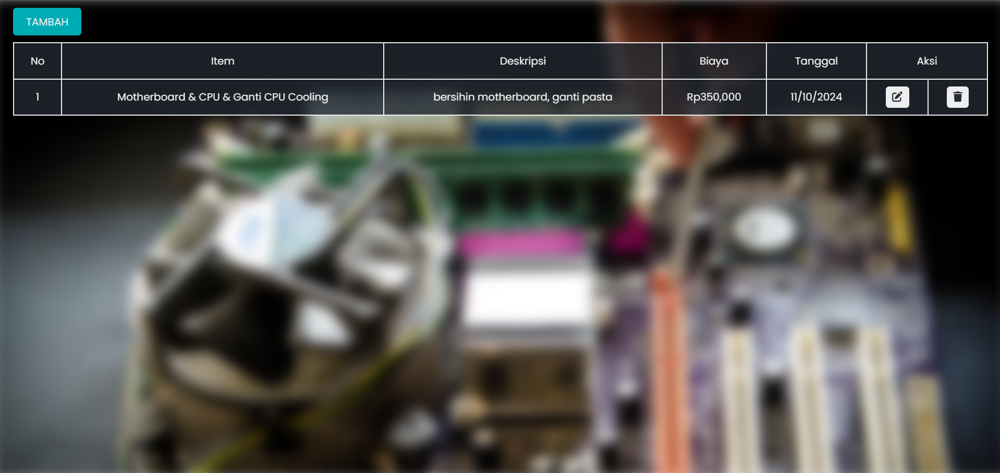
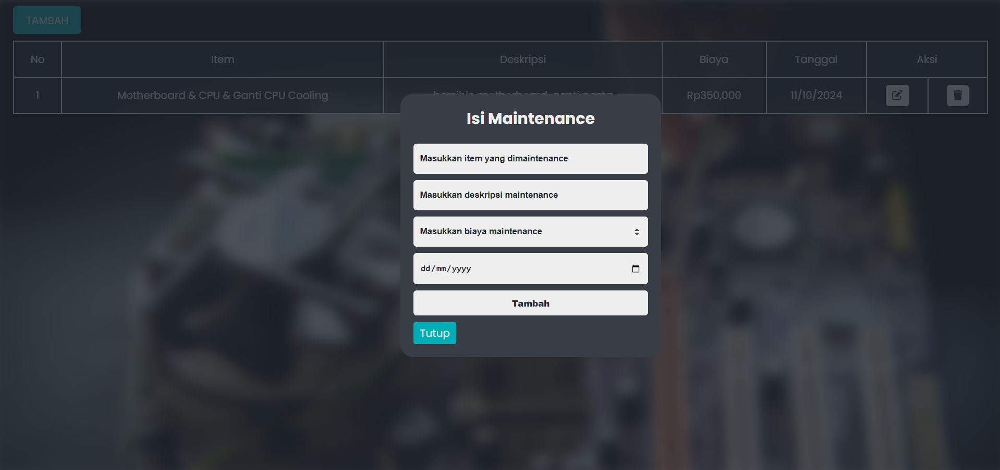
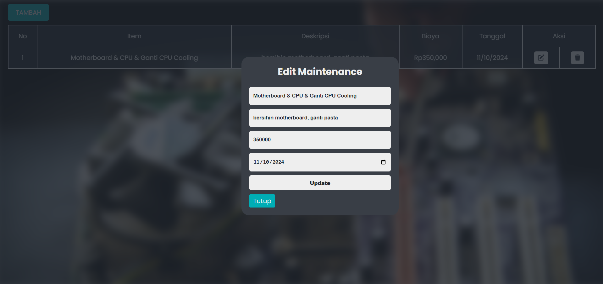

# APLIKASI SEDERHANA PENCATATAN PERAWATAN KOMPUTER

Aplikasi Pencatatan Perawatan Komputer ini adalah sebuah aplikasi web sederhana yang berfungsi untuk mencatat dan mengelola data perawatan komputer, termasuk item yang dirawat, deskripsi perawatan, biaya, dan tanggal perawatan. Aplikasi ini juga menyediakan fitur untuk menambahkan, mengedit, dan menghapus catatan perawatan.

## FITUR 

- Menambahkan catatan baru dengan mengisi item, deskripsi, biaya, dan tanggal perawatan.
- Semua catatan perawatan ditampilkan dalam bentuk tabel dengan informasi item, deskripsi, biaya, dan tanggal perawatan.
- Mengedit catatan perawatan yang sudah ada dengan memperbarui informasi yang diinginkan.
- Menghapus catatan perawatan yang sudah tidak diperlukan.

## TEKNOLOGI YANG DIGUNAKAN

- HTML
- CSS
- PHP
- SQLite
- FontAwesome

## CARA PENGGUNAAN

1. Untuk menambahkan catatan perawatan, klik tombol TAMBAH, lalu isi kotak form yang tersedia dan klik submit.
1. Untuk mengedit catatan yang ada, klik ikon Edit (ikon pensil), perbarui informasi yang diinginkan, dan klik tombol Update.
1. Untuk menghapus catatan, klik ikon Delete (ikon tempat sampah), dan konfirmasi penghapusan.

---

> **JIKA ADA KESALAHAN, BUG, DAN FITUR BARU BERIKAN KOMENTAR KALIAN DI ``` ISSUES ``` TAB**





---